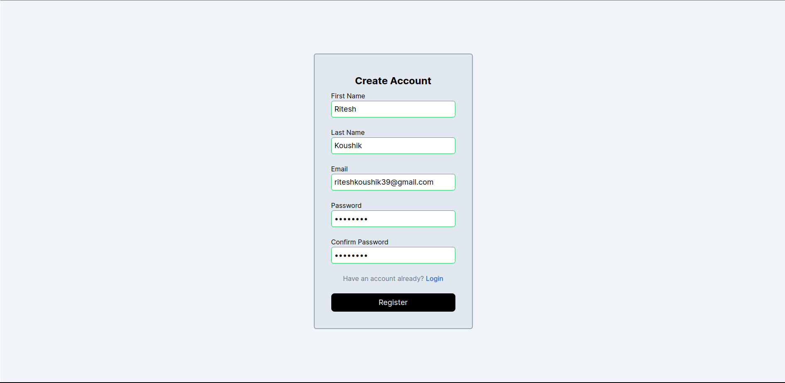

# Efficient Code Review Automation Tool (Client) 
This is project is a tool designed to upload Python, Java or Javascript projects to AWS's Codeguru Reviewer Service and provide Security and Code Quality reccomendations for the user.
This repository contains the frontend deployment for the project.

Tech Stack : `Next.js` `React.js` `TailwindCSS` `Typescript` 

**Backend Repository link** [here](https://github.com/IAmRiteshKoushik/coderev-bk).

## Overview
The project allows users to upload their file to AWS S3 repositories and get 
them reviewed by the Codeguru Reviewer service. The user can create multiple 
projects and can view the recommendatinons for each one, which will be displayed 
alongside the particular file's content for which the recommendation is 
generated.

## UI Screenshots

1. Registration Screen

2. Login Screen

3. Dashboard Screen

4. Create Repository Screen

5. Before Code Review

6. File Upload Screen

7. After Code Review


## Getting Started
1. Clone this repository into your local Linux environment.
2. cd to the destination folder
3. Install dependencies:

```bash
npm install
```
4. Run the React app:
```bash
npm run dev
```
Open the `http://localhost:3000/` to see the application running.

>Remember to check if the [server](https://github.com/IAmRiteshKoushik/coderev-bk) is configured and running for the web app to work. By default it should be running
on `http://localhost:5000/api`.

## Team Members

1. [Amruta Varshini](https://github.com/varshiniert) : Front-end Developer
2. [Dhaksana R](https://github.com/Dhaksana) : Front-end Developer
3. [Ritesh Koushik](https://github.com/IAmRiteshKoushik) : Full-Stack Developer
4. [Sudharsan Vanamali](https://github.com/Astrasv) : Back-end Developer
5. [Senthil Adithya V](https://github.com/a-dithya04) : Back-end Developer
